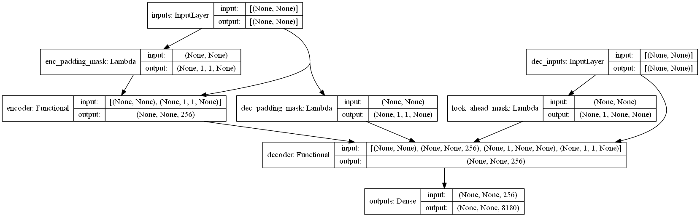

### Chatbot
Transformer을 활용한 한국어 챗봇

* Demo  


* Architecture  


#### Dataset
songys님의 chatbot_data의 위로봇를 욜로봇으로 데이터를 수정하여 학습
[songys/chatbot_data](https://raw.githubusercontent.com/songys/Chatbot_data/master/ChatbotData%20.csv)

#### environment
* RTX 3070 GPU X 1

#### Requirements
* Python >= 3.8
* Tensorflow >= 2.3.0
* Flask = 1.1.2
* numpy = 1.19.4

#### How to install
```sh
git clone https://github.com/pwr4779/Chatbot.git
cd Chatbot
pip install -r requirements.txt
```

#### Paper
* Transformer [Attention Is All You Need](https://arxiv.org/abs/1706.03762)


Check my blog post on attention and transformer:
* [blog](https://toitoitoi79.tistory.com/82)

#### reference
* https://github.com/Kyubyong/transformer
* https://github.com/lilianweng/transformer-tensorflow
* https://github.com/DongjunLee/transformer-tensorflow
